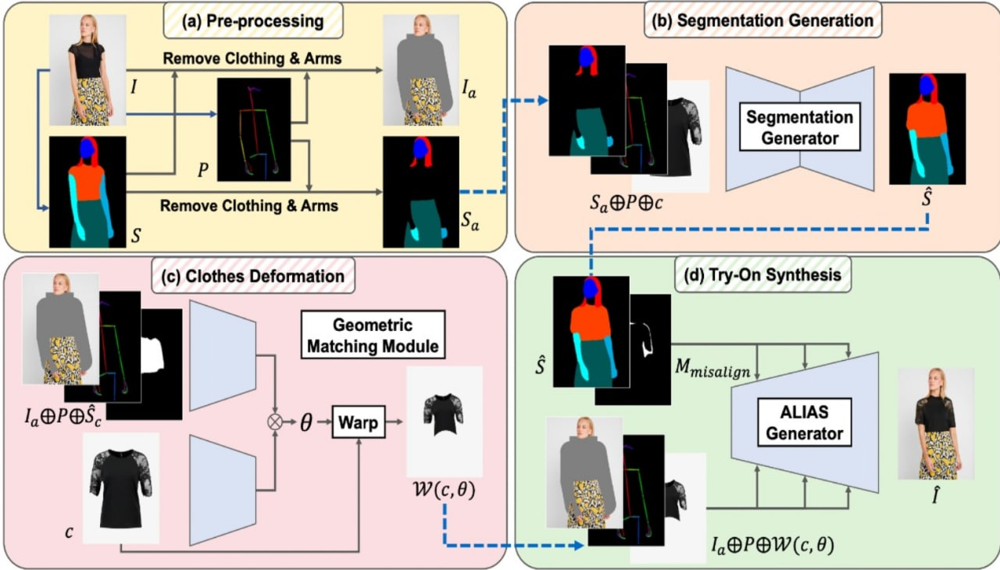
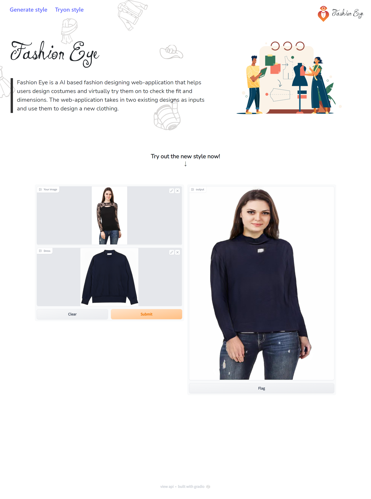

# FashionEye
- As part of the mini project me and my team came up with FashionEye
- It is an online service to allow users to input 2 cloth images and generate a new design
- The user can also upload their own image and choose a prefered cloth design to virtually try out the model.
- The following is the code to the project
#### Viton HD model architecture

#### Screenshot of FashionEye

